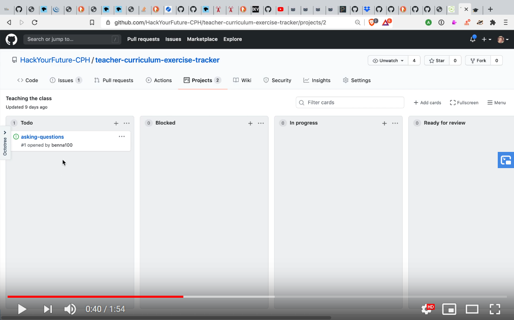

# Teacher curriculum

> [gitbook outline](https://hyfbe.gitbook.io/teacher-curriculum/)

One of the biggest parts of the education in HackYourFuture is our mentors teaching the students. That can be a daunting experience if you have not taught students before.

Therefore we have made a learning path for our mentors to become better teachers. Just like our students are put on a learning path to become web developers so should the mentors have the possibility to go on a learning path to become teachers.

This repo serves as the curriculum for what the mentors should go through in order to become a certified HackYourFuture teacher. It is one way of giving back to the mentors that have given us so incredibly much 🥇

---

## Overview

---

## Enrolling in the teacher curriculum - Becoming a certified HYF teacher

Just like the student have homework the same is true for the teacher curriculum. Instead of homework there are exercises for each topic and a "final project" for each learning path. To hand in the exercises we use project boards in this [repo](https://github.com/HackYourFuture-CPH/teacher-curriculum-exercise-tracker/projects). There is a project board for each learning path. 

Let us know if you're interested and we'll invite you as a collaborator to the "coach-study" repo

## Submitting assignments

Create an issue for each exercise like you can see [here](https://github.com/HackYourFuture-CPH/teacher-curriculum-exercise-tracker/issues/1)

When the exercise is ready for review put the issue in the `Ready for review` column. When another mentor has reviewed it pull it in `Done`

Here is [a video](https://www.youtube.com/watch?v=YR0-olyOkQY) of Evan explaining more about how it works:

)

### Getting the certificate 🏆

In order to get the HYF certificate you need to do the exercises and get feedback on them.

Just want to get started click here:

  

---

<!--
## Workshops

Schedules, slide shows, materials, and guides for running your own in-person workshops using the materials in this repo.

---
-->

## Contributing to the teacher curriculum

We would love your help with contributing to the curiculum! So please if you want to add/change anything regarding the curriculum, please make a PR to the [teacher curriculum repo](https://github.com/HackYourFuture-CPH/teacher-curriculum/)

If you want to contribute but don't have an idea for something new. Look in the [summary file](./SUMMARY.md). The topics and exercises that are outcommented still needs to be written.

---

### Tips and Tricks

Your pit-stop before preparing a lesson, mentoring a student, or starting class.  This section contains quick and actionable advice collected from the HYF community.  No background necessary!

---

### References

Links to great resources for learning more about education, and teaching programming. Including a list of _must-reads_: few concepts, articles, and videos you should check out before moving on.  These will lay the conceptual foundation for what you study in the rest of this gitbook.

---

### Topics

The section in this GitBook called topics is a collections of concepts and techniques in education that are helpful for teaching code.

If you only have a few minutes here and there, dive into the topics! You can learn something interesting and helpful in any amount of time.

---

### Exercises

Looking to go a little deeper and get some hands-on experience with the topics discussed above?  Take a look through the exercises!

Each exercise focuses on a particular skill you'll need as a coach. You'll practice creating class materials, evaluating assignments, an much more.

But wait! Exercises are for practice, repetition, and redundancy. When you find the exercise you want to work on, finish it more than once! Say you're practicing "_creating worked examples_", well then write 5 or 6.  Would you ever tell a student they only need to solve one coding challenge and they're good to go?

---

### Learning Paths

You're into it? You've got a few hours a week and want to get really good at teaching programming?  check out the learning paths.

Each learning path is a collection of topics & exercises that fit together to build a more complete skills set.

At the end of each learning path is a main project integrating everything you practiced along the way.
