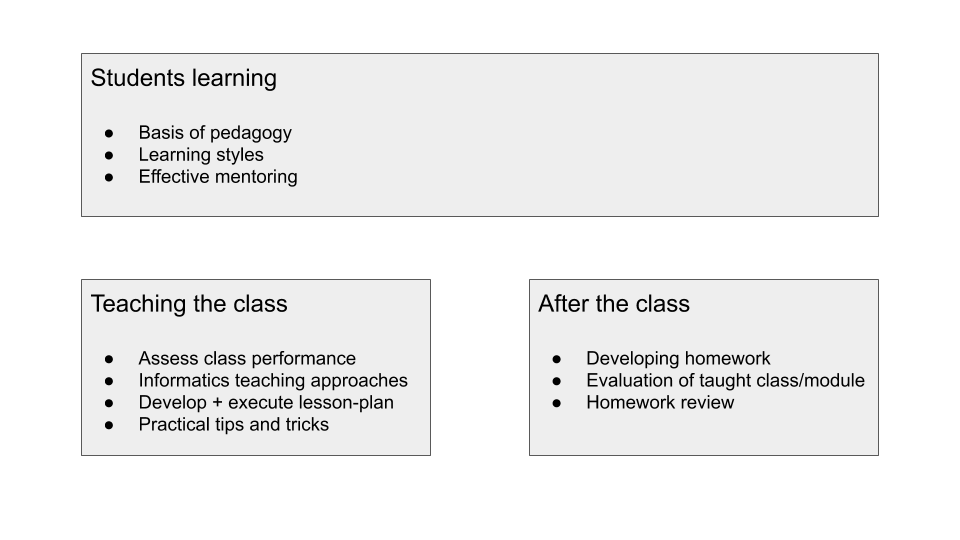

# Teacher curriculum

> [gitbook outline](https://hyfbe.gitbook.io/teacher-curriculum/)

One of the biggest parts of the education in HackYourFuture is our mentors teaching the students. That can be a daunting experience if you have not taught students before.

Therefore we have made a learning path for our mentors to become better teachers. Just like our students are put on a learning path when they enter HackYourFuture so should the mentors.

This repo serves as the curriculum for what the mentors should go through in order to become a certified HackYourFuture teacher™

The curriculum does not need to be followed in a specific order but can be completed when there is time

### Contents

  - [Overview](#overview)
  - [Topics](#topics)
  - [Exercises](#exercises)
  - [Learning Paths](#learning-paths)
  - [Joining Us](#joining-us)
  - [Workshops](#workshops)

---

## Overview

SHOULD WE HAVE A CATEGORY ONLY CALLED MENTORING STUDENTS???
- by mentoring you mean longer-term support of individual students? this could be a separate module

---

## Topics

The section in this GitBook called "topics" is a collections of concepts and techniques in education that are helpful for teaching programming.

If you only have a few minutes here and there, dive into the topics!  You can learn something interesting and helpful in any short amount of time.

---

## Exercises

Looking to go a little deeper and get some hands-on experience with the topics discussed above?  Take a look through the exercises!

Each exercise focuses on a particular skill you'll need as a coach.  You'll practice creating class materials, evaluating assignments, an much more.

But wait! Exercises are for practice, repetition, and redundancy. When you find the exercise you want to work on, finish it more than once!  Say you're practicing "_creating worked examples_", well then write 5 or 6.  Would you ever tell a student they only need to solve one coding challenge and they're good to go?

---

## Learning Paths

You're into it?  You've got a few hours a week and want to get really good at teaching programming?  check out the learning paths.

Each learning path is a collection of topics & exercises that fit together to build a more complete skills set.

At the end of each learning path is a main project integrating everything you practiced along the way.

---

## Joining Us

Do you like learning together?  Looking to share your experience with other coaches?  Get in touch with us and we can invite you as a contributor to our _teacher-training_ repository.

There you can track your progress through the learning paths on the repository project boards, give and receive feedback, and find others' interested in learning the same skills.

---

## Workshops

Schedules, slide shows, materials, and guides for running your own in-person workshops using the materials in this repo.

---

## Handing in exercises
If you want to get feedback on your exercise answers and also get the HYF teacher certificate, then you should be handing in exercises. 

Hand in homework [here](https://github.com/HackYourFuture-CPH/teacher-curriculum-exercise-tracker)

---

## Getting the certificate 🏆

In order to get the certificate you need to do all the exercises.
