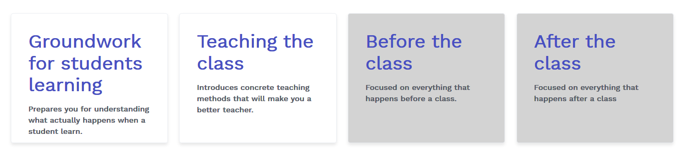

# Learning paths

The learning paths will **prepare you as a teacher** for different parts of being a teacher. It puts together topics and exercises that **will improve your teaching skills.** We have made two learning paths ready and two more in the pibeline.

## Groundwork for students learning

This learning path prepares you for **understanding what actually happens when a student learn.** which mechanisms and processes takes place inside of the brain. Which philosophies and schools are there when we talk about student learning. 

The goal of this learning path is not to come with the "correct answer" but more to **make the teacher reflect about the way he is teaching.**

This is why you should go through this learning path:
- You will **learn about learning**. Thereby making yourself a better student
- You will learn **what kind of learner you are** and how you you can apply that when learning a topic
- You will **understand why a students is struggling** and what you can do to help the student overcome the struggling
- You will get an insight into **how the brain works**

[Groundwork for student learning](./groundwork-for-student-learning.md)

## Teaching the class

This learning path is more concrete and hands on. It will **introduce concrete teaching methods** that will make you a better teacher. It will make you question the way teaching works and methods that have been around for 100 of years. 

This learning path works best if you have completed the groundwork for student learning learning path. 

This is why you should go through this learning path:
- You will **learn cutting edge teaching methods**
- It will help you **evaluate your own teaching**
- It will **make you a better teacher** through understanding how to better engage the students
- Your **students will perform better** and struggle with the right things

[Teaching the class](./teaching-the-class.md)

## Before the class *TBA*

This learning path is still being developed.This learning path will be **focused on everything that happens before a class.** It will cover how to best prepare for a class, how to develope exercises and improve/develop homework. 

## After the class *TBA*

This learning path is still being developed. It will **focus on what happens after the class.** That means evaluating your own teaching, giving feedback to other teachers and giving good feedback/reviews to students. 

## Learning paths overview

The order of the learning paths is:
1. Groundwork for student learning
2. Teaching the class

<!--

For making this image:https://www.hackyourfuture.net/

          

            

              
Groundwork for students learning

              
Prepares you for understanding what actually happens when a student learn.

            

          

          

            

              
Teaching the class

              
Introduces concrete teaching methods that will make you a better teacher.

            

          

          

            

              
Before the class

              
Focused on everything that happens before a class.

            

          

  

            

              
After the class

              
Focused on everything that happens after a class

            

          

  
        

-->

## Lets go 🎉

So what are you waiting for head into [Groundwork for student learning](./groundwork-for-student-learning.md) and **start developing your teacher skills 🚀**

