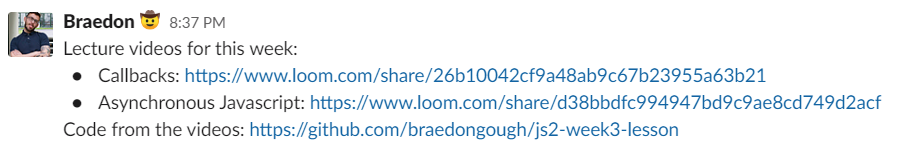

# Flipped classroom

Flipped classroom is a way to teach a class where students before class has watched a video lecture. Then in class there is a focus on exerises and homework. 

This approach ensures that the time spent with mentors is spent with active learning. The passive learning happens on the students own time.

## Preparation

- [What is flipped classroom](https://www.panopto.com/blog/what-is-a-flipped-classroom/)
- [Flipped classroom overview](https://elearning.dtu.dk/TEACH/Flipped-Classroom)
- [What if students dont watch videos? Part one](https://www.youtube.com/watch?v=g1MKpyVPilI)
- [What if students dont watch videos? Part two](https://www.youtube.com/watch?v=g1MKpyVPilI)

## Tips
- Remember to make the code written in the video lecture available to the students 

## Exercises

- [Flip a Sunday Class](./../exercises/flip-a-sunday-class.md)

## Learning Paths

- [Teaching the Class](../learning-paths/teaching-the-class.md)
